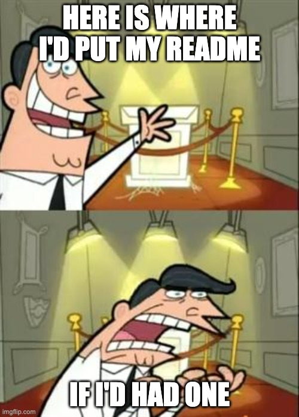

# Description
Cracking the Coding Interview coding exercises resolution

# Objective
Keep the mental elasticity when it comes to solve this type of exercises

# Languages
- Python (Currently doing)
- Typescript (Future)

# Off-Topic

